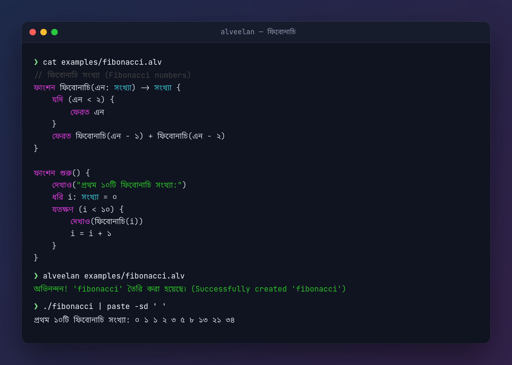
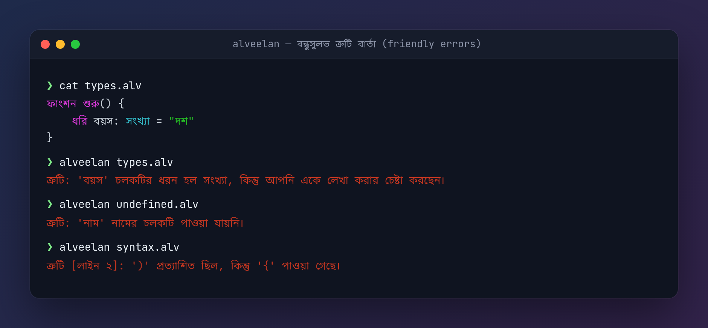

<div align="center">


# আলভীলান (Alveelan)

**শিশুদের জন্য বাংলা প্রোগ্রামিং ভাষা — LLVM দিয়ে সরাসরি মেশিন কোডে কম্পাইল হয়।**

[](https://github.com/happinessisreal/alveelan/actions/workflows/ci.yml)
[](LICENSE)

<sub><i>লোগো: “এটি অ নয়” — মাগরিতের “এটি পাইপ নয়”-এর মতো; কোডে একটি প্রতীক কখনোই সেই জিনিসটি নয়। জ্বলতে-নিভতে থাকা কার্সরটিই দাঁড়ি।</i></sub>

[English](README.md) · **বাংলা**



</div>

আলভীলান একটি সহজ এবং মজার প্রোগ্রামিং ভাষা, যা শিশুদের প্রোগ্রামিং শেখানোর জন্য তৈরি। এই ভাষার সমস্ত কিওয়ার্ড, ধরন আর ত্রুটি বার্তা বাংলায় হওয়ায় এটি বাঙালি শিশুদের জন্য অত্যন্ত সহজবোধ্য।

## প্রধান বৈশিষ্ট্যসমূহ

- **সম্পূর্ণ বাংলা কিওয়ার্ড**: `ধরি`, `যদি`, `নাহলে`, `যতক্ষণ`, `ফাংশন`, `ফেরত`, `দেখাও` ইত্যাদি।
- **বাংলা সংখ্যা**: কোডে `১০` বা `10` — দুটোই চলে, আর আউটপুটেও সংখ্যা আসে বাংলায় (৩০, ১২০, ৩.৫)।
- **বাংলায় ত্রুটি বার্তা**: ভুল হলে লাইন নম্বরসহ বাংলায় বুঝিয়ে বলে কোথায় সমস্যা।
- **তালিকা (Arrays)**: `তালিকা[সংখ্যা]` বা `তালিকা[লেখা]` দিয়ে একাধিক মান রাখা যায়।
- **ফাংশন**: নিজের ফাংশন তৈরি ও কল করা যায়, রিকার্সিভ ফাংশনও চলে।
- **দ্রুতগতি**: LLVM ব্যবহার করে সরাসরি মেশিন কোডে কম্পাইল হয়।

<p align="center"></p>

## কিওয়ার্ড এবং ধরন

### কিওয়ার্ড
| কিওয়ার্ড | কাজ |
|---|---|
| `ফাংশন` | ফাংশন তৈরি |
| `শুরু` | প্রধান ফাংশন (প্রোগ্রাম এখান থেকে শুরু হয়) |
| `ধরি` | চলক (variable) ঘোষণা |
| `যদি` / `নাহলে` | শর্ত (if / else) |
| `যতক্ষণ` | লুপ (while) |
| `ফেরত` | মান ফেরত দেওয়া (return) |
| `দেখাও` | স্ক্রিনে দেখানো (print) |
| `এবং` / `অথবা` / `না` | যুক্তি (and / or / not) |
| `সত্য` / `মিথ্যা` | true / false |

### ধরন
| ধরন | অর্থ |
|---|---|
| `সংখ্যা` | পূর্ণ সংখ্যা |
| `দশমিক` | দশমিক সংখ্যা |
| `লেখা` | লেখা (string) |
| `সত্যমিথ্যা` | সত্য অথবা মিথ্যা |
| `তালিকা[ধরন]` | একই ধরনের মানের তালিকা |

## উদাহরণ

### ১. হ্যালো পৃথিবী
```
ফাংশন শুরু() {
    দেখাও("হ্যালো পৃথিবী!")
}
```

### ২. গণিত
```
ফাংশন শুরু() {
    ধরি ক: সংখ্যা = ১০
    ধরি খ: সংখ্যা = ২০
    দেখাও(ক + খ)        // ৩০
}
```

### ৩. তালিকা
```
ফাংশন শুরু() {
    ধরি ক: তালিকা[সংখ্যা] = [১, ২, ৩]
    দেখাও(ক[০])          // ১
    ক[১] = ১০০
    দেখাও(ক[১])          // ১০০
}
```

### ৪. লুপ — ৫ এর নামতা
```
ফাংশন শুরু() {
    ধরি ঘর: সংখ্যা = ১
    যতক্ষণ (ঘর <= ১০) {
        দেখাও(৫ * ঘর)
        ঘর = ঘর + ১
    }
}
```

### ৫. রিকার্সিভ ফাংশন (ফ্যাক্টোরিয়াল)
```
ফাংশন ফ্যাক্টোরিয়াল(এন: সংখ্যা) -> সংখ্যা {
    যদি (এন <= ১) {
        ফেরত ১
    } নাহলে {
        ফেরত এন * ফ্যাক্টোরিয়াল(এন - ১)
    }
}

ফাংশন শুরু() {
    দেখাও(ফ্যাক্টোরিয়াল(৫))   // ১২০
}
```

আরও উদাহরণ আছে [`examples/`](examples) ফোল্ডারে। পুরো ভাষার নির্দেশিকা: [docs/LANGUAGE.md](docs/LANGUAGE.md)।

## ইন্সটলেশন

প্রয়োজন: [Rust](https://rustup.rs), একটি C কম্পাইলার (`cc`), এবং **LLVM ১৮–২১**।

```bash
# Ubuntu / Debian
sudo apt install llvm-18-dev libpolly-18-dev libzstd-dev clang
```

### ১. অটোমেটেড স্ক্রিপ্ট (সহজ পদ্ধতি)
```bash
chmod +x install.sh
./install.sh
```
স্ক্রিপ্টটি নিজেই আপনার LLVM সংস্করণ খুঁজে নেয়। ইন্সটল হয়ে গেলে আউটপুটে দেখানো নির্দেশনা অনুযায়ী `PATH` এ আলভীলান যোগ করুন।

### ২. ম্যানুয়াল ইন্সটলেশন
```bash
cargo build --release                                            # LLVM ১৮
cargo build --release --no-default-features --features llvm20    # অন্য সংস্করণ হলে
sudo cp target/release/alveelan /usr/local/bin/
```

## কিভাবে চালাবেন

১. আপনার কোড একটি `.alv` ফাইলে লিখুন (যেমন: `test.alv`)।
২. কম্পাইল করুন:
   ```bash
   alveelan test.alv
   ```
৩. একটি এক্সিকিউটেবল ফাইল তৈরি হবে (`./test`), যা সরাসরি চালানো যায়।

---
শুভ প্রোগ্রামিং!
